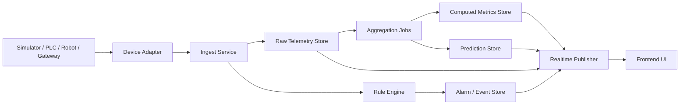
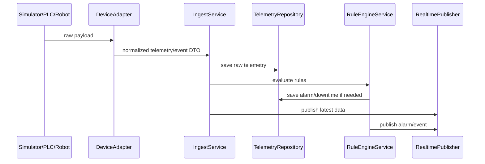
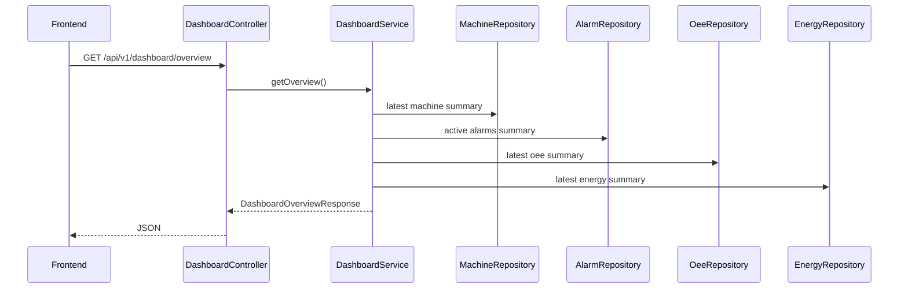
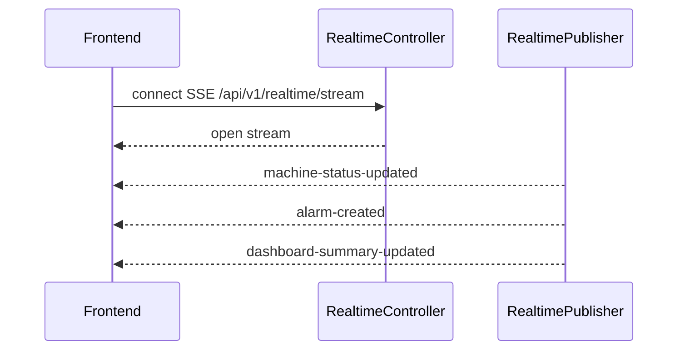

# Backend Implementation Plan for Manufacturing Monitor (Spring Boot)

> Mục tiêu của file này: giúp bạn và Copilot xây backend **đúng với UI hiện tại**, dễ mở rộng sang KUKA / Leantec / PLC thực tế, và vẫn **dễ đọc - dễ hiểu - dễ maintain** theo kiến trúc **N-layer / interface-impl / controller - service - repo - entity**.
>
> Tài liệu này cố tình viết theo kiểu **vừa là specification, vừa là note giải thích luồng**, để khi bạn code lại hoặc đọc code sau này vẫn hiểu vì sao hệ thống được thiết kế như vậy.

---

## 1. Mục tiêu backend

Backend này phải giải quyết 6 việc chính:

1. Nhận dữ liệu realtime từ thiết bị hoặc simulator.
2. Chuẩn hóa dữ liệu để không phụ thuộc hãng robot / PLC.
3. Lưu dữ liệu telemetry, event, alarm, OEE, tool, maintenance.
4. Tính toán các chỉ số tổng hợp để trả cho UI nhanh.
5. Push realtime cho UI hiện tại.
6. Mở rộng được sang adapter thật cho KUKA / Leantec / OPC UA / Modbus / MQTT.

### 1.1 Điều kiện thực tế hiện tại

- Bạn đã có UI frontend.
- Chưa chốt robot cụ thể.
- Muốn làm backend trước.
- Muốn hiểu được toàn bộ code, không muốn một hệ quá "ảo" hoặc quá enterprise đến mức khó đọc.

### 1.2 Kết luận thiết kế

Vì chưa biết robot nào, backend **không được bám chặt vào hãng**.
Thay vào đó, backend sẽ chia thành 2 lớp lớn:

- **lớp chuẩn hóa dữ liệu nội bộ**
- **lớp adapter kết nối thiết bị**

Điều đó có nghĩa là:

- hôm nay có thể dùng simulator
- mai có thể thay bằng `OpcUaAdapter`
- sau đó có thể thêm `KukaAdapter`, `LeantecAdapter`, `ModbusAdapter`

mà không phải đập lại controller, service, DB hay API trả về cho UI.

---

## 2. Backend phải bám những gì từ UI hiện tại

UI hiện tại đang có các nhóm trang chính:

- Dashboard tổng quan
- Machines
- Energy
- OEE
- Tools
- Maintenance
- Alarms
- Settings

### 2.1 Mapping chức năng FE -> BE

| Trang FE | Backend cần hỗ trợ |
|---|---|
| Dashboard | KPI tổng quan, machine summary, alarm summary, trạng thái online/offline, top issues |
| Machines | realtime theo từng máy, latest telemetry, trend ngắn hạn, event timeline |
| Energy | power, voltage, current, PF, energy theo giờ/ngày/ca |
| OEE | availability, performance, quality, OEE theo ca/ngày/máy |
| Tools | tool life, usage, cảnh báo sắp thay, lịch sử thay dao |
| Maintenance | maintenance due, health score, runtime hours, reminders |
| Alarms | active alarms, history, acknowledge, downtime timeline |
| Settings | ngưỡng cảnh báo, refresh rate, retention, machine config |

### 2.2 Điều quan trọng nhất

UI hiện tại rất hợp để làm demo-monitoring, nhưng backend cần chia rõ dữ liệu thành 3 lớp:

1. **Raw telemetry**: dữ liệu gốc từ PLC/robot/gateway.
2. **Computed metrics**: OEE, health score, summary theo ca/ngày.
3. **Predictions / recommendations**: tool life dự đoán, bảo trì dự đoán, nhắc nhở.

Không được trộn 3 lớp này vào một bảng hoặc một service duy nhất.

---

## 3. Kiến trúc tổng thể đề xuất

## 3.1 Kiến trúc logic



## 3.2 Tư duy kiến trúc

### A. Adapter layer
Dùng để nối với thiết bị thật hoặc simulator.

### B. Ingest layer
Nhận dữ liệu đã chuẩn hóa và đẩy vào hệ thống.

### C. Domain / business layer
Xử lý alarm, downtime, OEE, health, prediction.

### D. Storage layer
Lưu raw data, event data, aggregate data.

### E. Realtime layer
Push dữ liệu ra UI bằng SSE trước, WebSocket sau nếu cần.

---

## 4. Vì sao nên chọn kiểu N-layer + interface/impl

Bạn yêu cầu theo hướng:

- controller
- service
- repo
- entity
- interface / impl

Mình đồng ý, nhưng nên triển khai theo kiểu **N-layer có ranh giới rõ** chứ không chỉ chia folder cho đẹp.

### 4.1 Mục tiêu của việc tách interface/impl

- dễ đọc code
- dễ test
- dễ thay thế nguồn dữ liệu
- dễ thêm adapter thật sau này

### 4.2 Quy tắc thực chiến

- `controller`: chỉ nhận request, validate cơ bản, trả response
- `service`: chứa business logic
- `repository`: chỉ truy vấn DB
- `entity`: mapping DB
- `dto`: request/response contract
- `mapper`: chuyển entity <-> dto
- `adapter`: đọc dữ liệu từ nguồn ngoài
- `publisher`: đẩy realtime
- `scheduler`: job định kỳ

### 4.3 Không nên làm gì

- không nhét logic tính OEE vào controller
- không để repository chứa business rule
- không để entity kiêm response DTO
- không để adapter gọi thẳng controller
- không để UI query raw table kiểu tự phát

---

## 5. Cấu trúc package nên dùng

```text
com.yourcompany.manufacturingmonitor
├── ManufacturingMonitorApplication.java
├── config
│   ├── JacksonConfig.java
│   ├── OpenApiConfig.java
│   ├── SecurityConfig.java
│   ├── SseConfig.java
│   └── TimescaleConfig.java
├── common
│   ├── constant
│   ├── enumtype
│   ├── exception
│   ├── response
│   └── util
├── api
│   ├── controller
│   │   ├── DashboardController.java
│   │   ├── MachineController.java
│   │   ├── EnergyController.java
│   │   ├── OeeController.java
│   │   ├── ToolController.java
│   │   ├── MaintenanceController.java
│   │   ├── AlarmController.java
│   │   ├── SettingsController.java
│   │   ├── RealtimeController.java
│   │   └── IngestController.java
│   ├── request
│   └── response
├── domain
│   ├── entity
│   ├── repository
│   ├── service
│   │   ├── DashboardService.java
│   │   ├── MachineService.java
│   │   ├── EnergyService.java
│   │   ├── OeeService.java
│   │   ├── ToolService.java
│   │   ├── MaintenanceService.java
│   │   ├── AlarmService.java
│   │   ├── IngestService.java
│   │   ├── RealtimeService.java
│   │   ├── RuleEngineService.java
│   │   ├── AggregationService.java
│   │   └── PredictionService.java
│   └── mapper
├── infrastructure
│   ├── persistence
│   │   ├── entity
│   │   ├── repository
│   │   └── projection
│   ├── adapter
│   │   ├── simulator
│   │   ├── opcua
│   │   ├── modbus
│   │   ├── mqtt
│   │   ├── kuka
│   │   └── leantec
│   ├── realtime
│   │   ├── SseEmitterRegistry.java
│   │   └── RealtimePublisherImpl.java
│   └── scheduler
│       ├── AggregationScheduler.java
│       ├── MaintenanceScheduler.java
│       └── SimulationScheduler.java
└── docs
    └── api-examples.md
```

### 5.1 Giải thích đơn giản

- `api`: nơi giao tiếp với FE hoặc external ingest
- `domain`: logic nghiệp vụ cốt lõi
- `infrastructure`: mọi thứ liên quan DB, adapter, realtime, scheduler
- `common`: hạ tầng dùng chung

### 5.2 Gợi ý đơn giản hóa

Nếu bạn muốn code dễ hiểu hơn trong giai đoạn đầu, có thể gộp `domain.entity` và `infrastructure.persistence.entity` thành một lớp entity trước.

Nhưng khi project lớn hơn, nên tách:
- entity domain
- entity persistence
- dto response

---

## 6. Database nên dùng gì

## 6.1 Đề xuất chính

**PostgreSQL + TimescaleDB**

### Vì sao hợp với bài toán này

- có dữ liệu quan hệ: machine, config, settings, tool catalog
- có dữ liệu time-series: telemetry, energy, vibration, temperature, OEE history
- cần query vừa nghiệp vụ vừa thống kê
- số lượng máy ban đầu chưa nhiều
- Spring Boot làm việc với PostgreSQL rất thuận

### 6.2 Không nên dùng gì làm DB chính

- không dùng Redis làm DB chính
- không dùng MongoDB làm DB chính cho hệ này
- không dùng MySQL thuần nếu bạn muốn xử lý time-series dài hạn đẹp và dễ aggregate

### 6.3 Redis có thể dùng ở đâu

Redis là **optional**:
- cache dashboard summary
- giữ session emitter realtime
- queue nhẹ cho fan-out

Nhưng bản đầu tiên có thể chưa cần Redis.

---

## 7. Mô hình dữ liệu tổng thể

## 7.1 Chia dữ liệu thành 5 nhóm

### 1. Master / config data
Ví dụ:
- machine
- line
- plant
- tool catalog
- alert threshold
- maintenance rule

### 2. Raw telemetry
Ví dụ:
- machine state
- temperature
- vibration
- power
- cycle time
- spindle speed
- IO state

### 3. Event / alarm / downtime
Ví dụ:
- alarm active
- alarm history
- stop reason
- downtime event
- acknowledge info

### 4. Computed metrics
Ví dụ:
- OEE minute/hour/day
- energy hourly summary
- maintenance score
- machine health score

### 5. Prediction / recommendation
Ví dụ:
- tool remaining life
- maintenance due soon
- abnormal stop risk
- recommended action

---

## 8. Entity đề xuất

## 8.1 Master entities

### MachineEntity
```text
id
code
name
type                // ROBOT_ONLY, CNC_MACHINE, ROBOT_CNC_CELL
vendor              // KUKA, LEANTEC, SIEMENS, UNKNOWN
model
lineId
plantId
status
isEnabled
createdAt
updatedAt
```

### ToolCatalogEntity
```text
id
machineId
toolCode
toolName
toolType
lifeLimitMinutes
lifeLimitCycles
warningThresholdPct
criticalThresholdPct
createdAt
updatedAt
```

### MachineThresholdEntity
```text
id
machineId
metricCode          // TEMPERATURE, VIBRATION, POWER, TOOL_LIFE...
warningValue
criticalValue
unit
createdAt
updatedAt
```

## 8.2 Time-series entities

### MachineTelemetryEntity
Mỗi dòng là 1 snapshot theo thời gian cho 1 máy.

```text
id
machineId
ts
connectionStatus
machineState
operationMode
alarmActive
programName
cycleRunning
currentJob
powerKw
temperatureC
vibrationMmS
runtimeHours
cycleTimeSec
outputCount
goodCount
rejectCount
spindleSpeedRpm
feedRateMmMin
axisLoadPct
metadataJson
```

> `metadataJson` dùng để chứa dữ liệu hãng-specific tạm thời nếu chưa chuẩn hóa hết.
> Ví dụ: robot axis positions, gripper status, plate ready, custom bits.

### EnergyTelemetryEntity
```text
id
machineId
ts
voltageV
currentA
powerKw
powerFactor
frequencyHz
energyKwhShift
energyKwhDay
energyKwhMonth
```

### ToolUsageTelemetryEntity
```text
id
machineId
ts
toolCode
toolNumber
usageMinutes
usageCycles
spindleLoadPct
toolTemperatureC
remainingLifePct
wearLevel
```

### MaintenanceTelemetryEntity
```text
id
machineId
ts
motorTemperatureC
bearingTemperatureC
cabinetTemperatureC
vibrationMmS
runtimeHours
servoOnHours
startStopCount
lubricationLevelPct
batteryLow
```

## 8.3 Event entities

### AlarmEventEntity
```text
id
machineId
alarmCode
alarmType
severity
message
startedAt
endedAt
isActive
acknowledged
acknowledgedBy
acknowledgedAt
rawPayloadJson
```

### DowntimeEventEntity
```text
id
machineId
reasonCode
reasonGroup         // SAFETY, MATERIAL, PROGRAM, FAULT, MAINTENANCE...
startedAt
endedAt
durationSec
plannedStop
abnormalStop
notes
```

## 8.4 Aggregate entities

### OeeSnapshotEntity
```text
id
machineId
bucketStart
bucketType          // MINUTE, HOUR, SHIFT, DAY
availability
performance
quality
oee
runtimeSec
stopSec
goodCount
rejectCount
actualCycleTimeSec
idealCycleTimeSec
```

### MachineHealthSnapshotEntity
```text
id
machineId
bucketStart
healthScore
riskLevel
mainReason
temperatureScore
vibrationScore
alarmScore
runtimeScore
```

## 8.5 Prediction entities

### ToolPredictionEntity
```text
id
machineId
toolCode
ts
remainingMinutes
remainingCycles
riskLevel
confidenceScore
recommendedAction
```

### MaintenancePredictionEntity
```text
id
machineId
ts
remainingHoursToService
predictedFailureRisk
riskLevel
recommendedAction
nextMaintenanceDate
```

---

## 9. Repository nên thiết kế ra sao

## 9.1 Rule chung

- repository chỉ làm việc với DB
- không đặt business rule trong repository
- query phức tạp thì dùng projection / native query riêng

## 9.2 Ví dụ repository

```text
MachineRepository
ToolCatalogRepository
MachineThresholdRepository
MachineTelemetryRepository
EnergyTelemetryRepository
ToolUsageTelemetryRepository
MaintenanceTelemetryRepository
AlarmEventRepository
DowntimeEventRepository
OeeSnapshotRepository
MachineHealthSnapshotRepository
ToolPredictionRepository
MaintenancePredictionRepository
```

### 9.3 Query cần có sẵn

#### MachineTelemetryRepository
- findLatestByMachineId
- findByMachineIdAndTsBetween
- findLatestForAllMachines

#### AlarmEventRepository
- findActiveByMachineId
- countActiveCritical
- findHistoryByMachineIdAndRange

#### DowntimeEventRepository
- findAbnormalStopsByMachineIdAndRange
- summarizeByReasonGroup

#### OeeSnapshotRepository
- findLatestShiftSnapshot
- findRangeByMachineIdAndBucket

#### EnergyTelemetryRepository
- summarizeHourly
- summarizeDaily
- latestByMachineId

---

## 10. Service design

## 10.1 Service interface + impl

Ví dụ:

```text
MachineService
MachineServiceImpl
EnergyService
EnergyServiceImpl
OeeService
OeeServiceImpl
...
```

### 10.2 Tại sao cần interface

- giữ code dễ test
- rõ contract
- sau này mock service dễ
- dễ thay implementation nếu có caching / optimization riêng

---

## 11. Luồng dữ liệu chính trong hệ thống

## 11.1 Luồng A - từ thiết bị vào hệ thống



### Giải thích

1. PLC/robot/gateway hoặc simulator đẩy dữ liệu.
2. Adapter chuyển từ format hãng sang format chuẩn nội bộ.
3. IngestService lưu raw data.
4. RuleEngine kiểm tra ngưỡng, stop state, alarm condition.
5. Nếu phát hiện bất thường thì tạo alarm/event.
6. RealtimePublisher đẩy dữ liệu mới cho FE.

## 11.2 Luồng B - FE load dashboard



### Giải thích

Dashboard không nên query raw telemetry cực chi tiết rồi tự ghép ở controller.
Thay vào đó, `DashboardService` gom dữ liệu từ nhiều nguồn và trả đúng shape FE cần.

## 11.3 Luồng C - FE nhận realtime



### Giải thích

FE chỉ subscribe stream và cập nhật UI.
FE không phải polling quá nhiều endpoint mỗi 2 giây nếu backend đã push dữ liệu.

---

## 12. Realtime nên làm thế nào

## 12.1 Giai đoạn 1

Dùng **SSE**.

### Vì sao

- đơn giản hơn WebSocket
- rất hợp cho dashboard chỉ cần server push
- frontend Next.js xử lý được
- Spring Boot support tốt

### Dùng cho

- machine latest state
- active alarms
- dashboard summary update
- maintenance reminder update

## 12.2 Giai đoạn 2

Chỉ chuyển sang WebSocket khi bạn cần:

- nhiều topic phức tạp
- chat/command hai chiều
- subscription linh hoạt hơn
- fan-out lớn

### 12.3 Quy tắc realtime

Không push toàn bộ lịch sử mỗi lần update.
Chỉ push:
- latest machine state
- new alarm
- updated summary
- changed prediction

---

## 13. API contract đề xuất

> Prefix chung: `/api/v1`

## 13.1 Dashboard APIs

### GET `/api/v1/dashboard/overview`
Trả về:
- total machines
- online machines
- running machines
- active critical alarms
- plant power now
- today energy
- oee today
- abnormal stops today
- top risky machines

### GET `/api/v1/dashboard/timeline`
Trả về timeline ngắn để vẽ chart tổng.

---

## 13.2 Machines APIs

### GET `/api/v1/machines`
Danh sách máy.

### GET `/api/v1/machines/{machineId}`
Chi tiết máy.

### GET `/api/v1/machines/{machineId}/latest`
Snapshot mới nhất.

### GET `/api/v1/machines/{machineId}/telemetry`
Query theo time range.

### GET `/api/v1/machines/{machineId}/events`
Alarm + downtime history.

### GET `/api/v1/machines/{machineId}/health`
Health snapshot + latest indicators.

---

## 13.3 Energy APIs

### GET `/api/v1/energy/overview`
### GET `/api/v1/energy/machines/{machineId}`
### GET `/api/v1/energy/trend?from=&to=&bucket=`

---

## 13.4 OEE APIs

### GET `/api/v1/oee/overview`
### GET `/api/v1/oee/machines/{machineId}`
### GET `/api/v1/oee/machines/{machineId}/trend`
### GET `/api/v1/oee/machines/{machineId}/losses`

`losses` nên trả về breakdown theo:
- availability loss
- performance loss
- quality loss
- downtime reason

---

## 13.5 Tool APIs

### GET `/api/v1/tools/overview`
### GET `/api/v1/tools/machines/{machineId}`
### GET `/api/v1/tools/machines/{machineId}/predictions`
### POST `/api/v1/tools/{toolId}/replace`

---

## 13.6 Maintenance APIs

### GET `/api/v1/maintenance/overview`
### GET `/api/v1/maintenance/machines/{machineId}`
### GET `/api/v1/maintenance/machines/{machineId}/predictions`
### POST `/api/v1/maintenance/{machineId}/confirm`

---

## 13.7 Alarm APIs

### GET `/api/v1/alarms/active`
### GET `/api/v1/alarms/history`
### POST `/api/v1/alarms/{alarmId}/acknowledge`
### GET `/api/v1/downtime/overview`
### GET `/api/v1/downtime/machines/{machineId}`

---

## 13.8 Settings APIs

### GET `/api/v1/settings/thresholds`
### PUT `/api/v1/settings/thresholds`
### GET `/api/v1/settings/system`
### PUT `/api/v1/settings/system`

---

## 13.9 Realtime APIs

### GET `/api/v1/realtime/stream`
Stream tổng quan toàn hệ thống.

### GET `/api/v1/realtime/machines/{machineId}/stream`
Stream riêng cho một máy.

### Event names đề xuất

- `machine-status-updated`
- `machine-telemetry-updated`
- `alarm-created`
- `alarm-acknowledged`
- `downtime-created`
- `dashboard-summary-updated`
- `tool-prediction-updated`
- `maintenance-prediction-updated`

---

## 14. Adapter layer - cực quan trọng vì bạn chưa biết robot nào

## 14.1 Interface gốc

```java
public interface DeviceAdapter {
    String adapterCode();
    void start();
    void stop();
    boolean supports(String machineVendor);
}
```

## 14.2 Interface cho dữ liệu kéo vào hệ thống

```java
public interface TelemetryIngestGateway {
    void ingestTelemetry(NormalizedTelemetryDto dto);
    void ingestAlarm(NormalizedAlarmDto dto);
    void ingestDowntime(NormalizedDowntimeDto dto);
}
```

## 14.3 Các adapter nên có roadmap

### Giai đoạn đầu
- `SimulatorAdapter`

### Sau đó
- `OpcUaAdapter`
- `ModbusTcpAdapter`
- `MqttAdapter`

### Khi chốt thiết bị
- `KukaAdapter`
- `LeantecAdapter`

## 14.4 Vì sao làm vậy

Bởi vì robot hãng nào rồi cũng sẽ khác cách trả dữ liệu.
Nhưng nếu tất cả cùng map về:
- machine state
- mode
- alarm
- power
- temperature
- vibration
- cycle time
- counts

thì phần còn lại của backend không cần biết dữ liệu đến từ đâu.

---

## 15. Normalized DTO - trái tim của hệ thống

Đây là phần quan trọng nhất để backend "không chết vì phụ thuộc hãng".

## 15.1 NormalizedTelemetryDto

```text
machineId
ts
connectionStatus
machineState
operationMode
programName
cycleRunning
powerKw
temperatureC
vibrationMmS
runtimeHours
cycleTimeSec
outputCount
goodCount
rejectCount
spindleSpeedRpm
feedRateMmMin
toolCode
remainingToolLifePct
metadata
```

## 15.2 Rule khi dùng DTO này

- field nào máy không có thì để `null`
- không ép mọi máy phải có spindle/feed/tool
- robot-only và cnc-machine dùng cùng schema nhưng khác mật độ field
- field đặc thù hãng lưu thêm trong `metadata`

---

## 16. Business modules cần có

## 16.1 IngestService

### Nhiệm vụ
- nhận DTO đã chuẩn hóa
- validate dữ liệu
- lưu raw telemetry
- gọi rule engine
- gọi realtime publisher

### Không nên làm
- không tự query UI data ở đây
- không tính dashboard summary quá nặng trong request sync

## 16.2 RuleEngineService

### Nhiệm vụ
- kiểm tra vượt ngưỡng
- tạo alarm mới
- đóng alarm nếu trạng thái bình thường lại
- phát hiện downtime bất thường
- phân loại reason group

### Ví dụ rule
- nhiệt độ > warningThreshold -> warning alarm
- vibration > criticalThreshold -> critical alarm
- state RUNNING -> STOPPED và không phải planned stop -> abnormal stop
- remainingToolLifePct < 15 -> critical tool alarm

## 16.3 AggregationService

### Nhiệm vụ
- tính OEE theo bucket
- tính energy summary
- tính machine summary
- tính health score

### Chạy kiểu nào
- scheduled job
- hoặc chạy incremental sau mỗi batch ingest

## 16.4 PredictionService

### Giai đoạn đầu
chỉ dùng rule-based prediction, chưa cần AI phức tạp.

Ví dụ:
- runtimeHours gần mốc bảo trì -> due soon
- vibration tăng liên tục + nhiệt tăng -> maintenance risk high
- tool life còn < 20% -> replace soon

### Giai đoạn sau
mới thêm model ML nếu cần.

## 16.5 RealtimeService

### Nhiệm vụ
- quản lý subscriber SSE
- đẩy event đúng topic
- cleanup emitter chết

---

## 17. Scheduler / jobs nên có

## 17.1 SimulationScheduler

Dùng để tạo dữ liệu giả nếu chưa có thiết bị thật.

### Mục tiêu
- FE có dữ liệu sống
- BE test toàn luồng
- dễ demo

## 17.2 AggregationScheduler

Chạy mỗi 1 phút hoặc 5 phút để:
- tính OEE snapshot
- tính energy summary
- tính health score

## 17.3 MaintenanceScheduler

Chạy mỗi 15 phút hoặc mỗi giờ để:
- kiểm tra mốc bảo trì
- tạo reminder
- cập nhật prediction status

## 17.4 CleanupScheduler

- xóa / archive dữ liệu quá cũ nếu cần
- cleanup emitter timeout
- dọn job lỗi

---

## 18. Phù hợp với UI hiện tại như thế nào

## 18.1 Dashboard

Backend cần trả về object kiểu:

```json
{
  "totalMachines": 5,
  "onlineMachines": 5,
  "runningMachines": 3,
  "criticalAlarms": 2,
  "plantPowerKw": 48.7,
  "todayEnergyKwh": 1120.4,
  "todayOee": 78.4,
  "abnormalStops": 4,
  "topRiskMachines": [
    {
      "machineId": "MC-04",
      "machineName": "CNC Milling 01",
      "riskLevel": "HIGH",
      "reason": "Tool life critical"
    }
  ]
}
```

## 18.2 Machine detail

UI trang máy cần dữ liệu 3 tầng:

### latest snapshot
- trạng thái hiện tại
- mode
- program
- power
- temperature
- vibration
- cycle time

### chart trend
- power trend
- temp trend
- vibration trend
- output trend

### side panel
- active alarms
- last events
- maintenance due
- tool life

## 18.3 Energy page

BE trả:
- current power by machine
- energy by shift/day/month
- trend chart
- PF / voltage / current

## 18.4 OEE page

BE trả:
- availability
- performance
- quality
- oee
- breakdown losses
- trend theo bucket

## 18.5 Tools page

BE trả:
- tool usage list
- remaining life
- risk level
- replacement recommendations

## 18.6 Maintenance page

BE trả:
- runtime hours
- due soon count
- health score
- prediction list
- confirm maintenance actions

## 18.7 Alarms page

BE trả:
- active alarms
- alarm history
- downtime history
- abnormal stop trend
- acknowledge action

---

## 19. Giai đoạn phát triển nên đi theo thứ tự nào

## Phase 1 - dựng xương sống

### Mục tiêu
Có project chạy được, có DB, có REST cơ bản.

### Việc cần làm
- tạo Spring Boot project
- cấu hình PostgreSQL
- cấu hình Flyway
- tạo base package structure
- tạo common response format
- tạo exception handler
- tạo `MachineEntity`
- tạo `MachineRepository`
- tạo `MachineService` + impl
- tạo `MachineController`
- tạo seed dữ liệu 5 máy

### Kết quả mong muốn
- chạy app ổn
- gọi `/api/v1/machines` được
- UI có thể lấy danh sách máy

## Phase 2 - ingest + simulator

### Mục tiêu
Backend có dữ liệu sống.

### Việc cần làm
- tạo `NormalizedTelemetryDto`
- tạo `IngestController`
- tạo `IngestService`
- tạo `MachineTelemetryEntity`
- tạo `SimulatorAdapter`
- tạo `SimulationScheduler`
- lưu telemetry vào DB

### Kết quả mong muốn
- hệ có dữ liệu realtime giả lập
- máy có latest state
- trang machines bắt đầu ăn API thật

## Phase 3 - realtime

### Mục tiêu
FE nhận update mà không phải poll nhiều.

### Việc cần làm
- tạo `RealtimeController`
- tạo `SseEmitterRegistry`
- tạo `RealtimePublisher`
- publish telemetry + alarm

### Kết quả mong muốn
- dashboard cập nhật realtime
- machine detail đổi số theo stream

## Phase 4 - alarms + downtime

### Mục tiêu
Có logic bất thường cơ bản.

### Việc cần làm
- tạo `AlarmEventEntity`
- tạo `DowntimeEventEntity`
- tạo `RuleEngineService`
- viết threshold rules
- tạo acknowledge API

### Kết quả mong muốn
- UI alarm page chạy thật
- abnormal stop xuất hiện theo logic

## Phase 5 - OEE + energy aggregate

### Mục tiêu
Có KPI đủ đẹp cho dashboard và trang OEE/Energy.

### Việc cần làm
- tạo `OeeSnapshotEntity`
- tạo `EnergyTelemetryEntity`
- viết `AggregationService`
- tạo scheduled jobs
- tạo API cho dashboard / oee / energy

### Kết quả mong muốn
- UI dashboard, OEE, energy không còn dựa hoàn toàn vào mock FE

## Phase 6 - tools + maintenance

### Mục tiêu
Có phần prediction rule-based.

### Việc cần làm
- tạo `ToolUsageTelemetryEntity`
- tạo `ToolPredictionEntity`
- tạo `MaintenanceTelemetryEntity`
- tạo `MaintenancePredictionEntity`
- viết `PredictionService`

### Kết quả mong muốn
- UI tools và maintenance có dữ liệu backend thật

## Phase 7 - adapter thật

### Mục tiêu
Thay simulator bằng adapter thiết bị thật.

### Việc cần làm
- chốt giao thức thực tế
- viết `OpcUaAdapter` hoặc `ModbusTcpAdapter`
- sau đó mới thêm `KukaAdapter` / `LeantecAdapter`
- map về normalized DTO

---

## 20. Coding rules để dễ hiểu code

## 20.1 Rule đặt tên

- interface: `MachineService`
- impl: `MachineServiceImpl`
- controller: `MachineController`
- repo: `MachineRepository`
- entity: `MachineEntity`
- request dto: `CreateMachineRequest`
- response dto: `MachineDetailResponse`

## 20.2 Rule service

Mỗi service nên có method rõ nghĩa:

```java
MachineDetailResponse getMachineDetail(String machineId);
LatestMachineSnapshotResponse getLatestSnapshot(String machineId);
PageResponse<AlarmHistoryItemResponse> getAlarmHistory(...);
void acknowledgeAlarm(String alarmId, AckAlarmRequest request);
```

Không viết kiểu:

```java
Object handleEverything(Map<String, Object> payload)
```

## 20.3 Rule controller

Controller chỉ làm 4 việc:
- nhận input
- validate input
- gọi service
- trả response

## 20.4 Rule entity

Entity chỉ nên đại diện dữ liệu lưu trữ.
Không gắn quá nhiều logic tính toán vào entity.

## 20.5 Rule DTO

Response DTO phải bám UI.
Đừng bắt frontend tự nối dữ liệu quá nhiều nếu backend có thể trả shape đẹp hơn.

---

## 21. Chuẩn response nên dùng

```json
{
  "success": true,
  "message": "OK",
  "data": {},
  "timestamp": "2026-03-26T08:30:00Z"
}
```

### Với lỗi

```json
{
  "success": false,
  "message": "Machine not found",
  "errorCode": "MACHINE_NOT_FOUND",
  "timestamp": "2026-03-26T08:30:00Z"
}
```

---

## 22. Những điểm rất nên làm để backend “xịn mà vẫn mượt”

## 22.1 Dùng Flyway từ đầu
Để schema versioning rõ ràng.

## 22.2 Viết seed dữ liệu cho 5 máy
Để team luôn có dữ liệu ổn định khi dev.

## 22.3 Viết OpenAPI/Swagger
Để FE và BE làm việc nhanh.

## 22.4 Có simulator riêng
Đây là thứ rất đáng giá nếu chưa có robot thật.

## 22.5 Tách raw data và aggregate data
Query dashboard sẽ nhanh hơn và code sạch hơn.

## 22.6 Viết log tốt
Log ingest, alarm generation, scheduler result phải rõ.

## 22.7 Có global exception handler
Để API trả lỗi đồng nhất.

---

## 23. Những lỗi kiến trúc nên tránh

1. Ghi tất cả dữ liệu vào một bảng JSON duy nhất.
2. Để frontend tự tính OEE từ 20 API nhỏ.
3. Chỉ dùng poll mà không có stream realtime.
4. Gắn cứng KUKA/Leantec vào service lõi.
5. Để service trả về entity trực tiếp cho controller.
6. Tạo DTO quá chung chung, thiếu field theo UI.
7. Dùng một service duy nhất xử lý tất cả module.
8. Không tách alarm và downtime.
9. Không lưu timestamps chuẩn.
10. Không có simulator khi chưa có thiết bị thật.

---

## 24. Danh sách công việc cụ thể cho backend

## 24.1 Công việc 1 - tạo skeleton project
- tạo project Spring Boot
- thêm dependency: web, validation, data-jpa hoặc jdbc, postgresql, flyway, lombok, actuator, openapi
- tạo package structure chuẩn
- tạo `application.yml`
- tạo profile `local`, `dev`

## 24.2 Công việc 2 - dựng nền tảng chung
- base response
- exception handler
- enum machine state / severity / risk level / bucket type
- common utilities

## 24.3 Công việc 3 - module machine
- entity
- repo
- service + impl
- controller
- seed 5 máy

## 24.4 Công việc 4 - module ingest
- normalized DTO
- ingest API
- validation
- save raw telemetry

## 24.5 Công việc 5 - module simulator
- simulator adapter
- scheduled emission
- fake random nhưng có rule hợp lý
- fake alarm / fault / downtime

## 24.6 Công việc 6 - module realtime
- SSE registry
- stream endpoint
- publish methods
- cleanup timeout

## 24.7 Công việc 7 - module alarms/downtime
- entity + repo
- rule engine
- active/history APIs
- acknowledge API

## 24.8 Công việc 8 - module energy + OEE
- energy telemetry entity
- oee aggregate entity
- aggregation service
- APIs cho energy và oee

## 24.9 Công việc 9 - module tools + maintenance
- tool usage entity
- maintenance telemetry entity
- prediction rule-based
- replacement / confirm APIs

## 24.10 Công việc 10 - module settings
- threshold config
- retention config
- machine config
- update APIs

---

## 25. Gợi ý dependency ban đầu

```xml
spring-boot-starter-web
spring-boot-starter-validation
spring-boot-starter-data-jpa
postgresql
flyway-core
springdoc-openapi-starter-webmvc-ui
lombok
spring-boot-starter-actuator
```

> Nếu telemetry ingest nhiều, sau này có thể cân nhắc thêm JDBC hoặc jOOQ cho phần query/time-series nặng.

---

## 26. Recommendation cuối cùng

### Nếu hôm nay bắt đầu code
Hãy làm đúng thứ tự này:

1. skeleton project
2. machine module
3. ingest module
4. simulator module
5. realtime SSE
6. alarms/downtime
7. OEE/energy aggregate
8. tools/maintenance
9. settings
10. adapter thật

### Nếu muốn hiểu code sâu
Hãy giữ đúng nguyên tắc:

- controller mỏng
- service rõ nghĩa
- repo chỉ truy vấn
- DTO bám UI
- adapter tách khỏi business core
- raw data tách khỏi aggregate data
- prediction để riêng, không trộn vào ingest

---

## 27. Checklist chốt để Copilot/code follow đúng

- [ ] Code theo N-layer rõ ràng
- [ ] Có interface/impl cho service chính
- [ ] Có simulator trước khi có robot thật
- [ ] Dùng PostgreSQL + TimescaleDB
- [ ] Dùng SSE cho realtime giai đoạn đầu
- [ ] Tách raw telemetry / events / computed metrics / predictions
- [ ] API bám đúng trang UI hiện tại
- [ ] Có seed 5 máy
- [ ] Có Flyway migration
- [ ] Có Swagger/OpenAPI
- [ ] Có global exception handler
- [ ] Không gắn cứng backend vào một hãng robot

---

## 28. Câu chốt ngắn gọn

Backend tốt nhất cho bạn lúc này không phải là backend nối robot thật ngay, mà là backend có **xương sống đúng**:

- schema đúng
- luồng ingest đúng
- realtime đúng
- aggregate đúng
- prediction đúng
- adapter tách riêng

Làm đúng như vậy thì sau này dù bạn nối KUKA, Leantec, PLC hay gateway khác, hệ vẫn phát triển mượt và bạn vẫn hiểu được code của chính mình.
